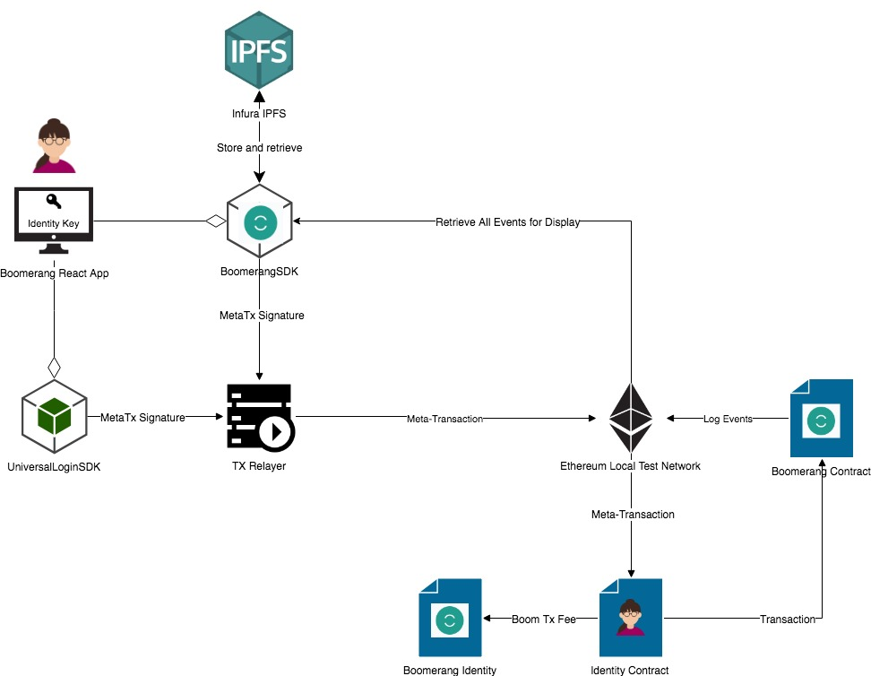
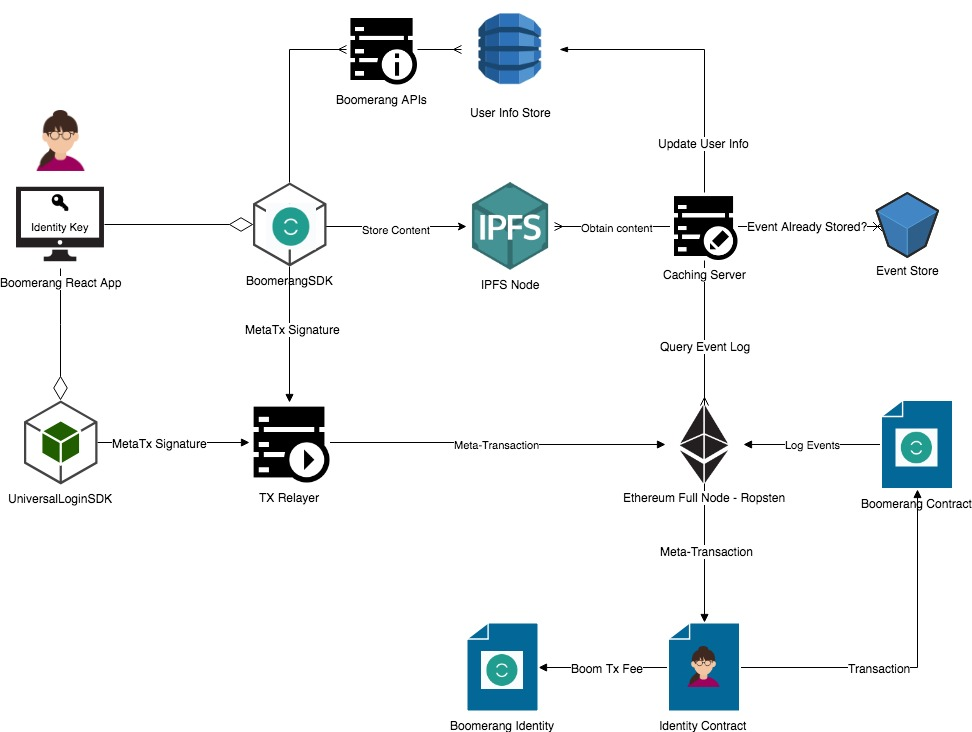
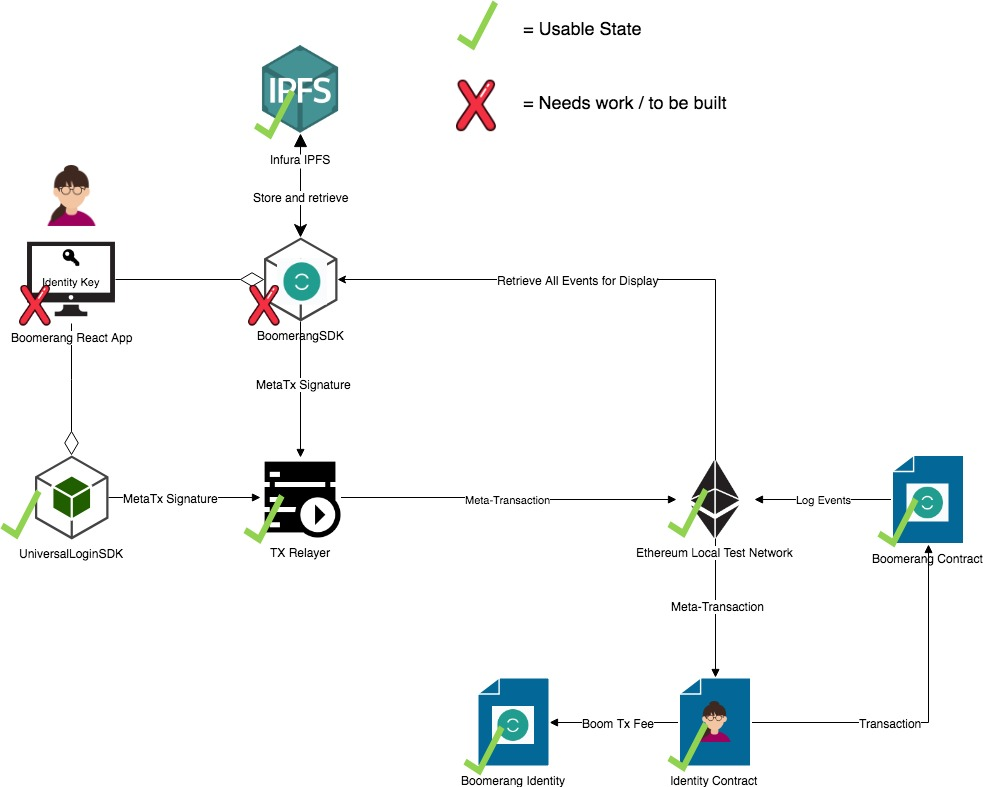

# Boomerang Architecture Overview
Boomerang will implement a [Universal Login](https://github.com/BoomerangProject/boomerang-wiki/blob/master/architecture/UniversalLogin.md) which will make use of a [Metatransaction Relayer](https://github.com/BoomerangProject/boomerang-wiki/blob/master/architecture/MetaTransactionRelayer.md) in order to create a seamless user expierence that mirrors the typical flow of a Web 2.0 Application.

In addition, Boomerang will develop the [BoomerangSDK](https://github.com/BoomerangProject/boomerang/blob/master/boomerang-sdk/README.md) for our [Boomerang React App]() and for [Businesses](https://github.com/BoomerangProject/boomerang-wiki/blob/master/architecture/BusinessIntegration.md) to use in order to request reviews, and retreive historical reviews, ratings, and experience levels.

To support the BoomerangSDK, the Boomerang Foundation will build an [Event Caching Layer](https://github.com/BoomerangProject/boomerang-wiki/blob/master/architecture/CachingService.md) that will serve data more rapidly to the BoomerangSDK through [BoomerandAPIs (TBD)]() rather than querying an Ethereum full node, and will allow the user to interact with the DApp without a web3 provider.

The [Boomerang Smart Contracts](https://github.com/BoomerangProject/boomerang/blob/master/boomerang-contracts/README.md) allow businesses to submit review request, and allow users to submit reviews about a worker or business, and the [Boomerang Reward System (TBD)]() will be built off of the information that the contract's events log.

As part of integration with Boomerang, Skedaddle will create an [Identity Provisioning Service (TBD)]() which will give identities to new users and an [Identity Recovery Service (TBD)]() which will act as an optional central recovery service for Skedaddle users who misplace backup codes or lose access to their devices.

## Alpha Architecture (Local Testnet)

## Beta Architecture (Ropsten Testnet)

## Release Architecture (Mainnet)

## Current State - Approaching Alpha

