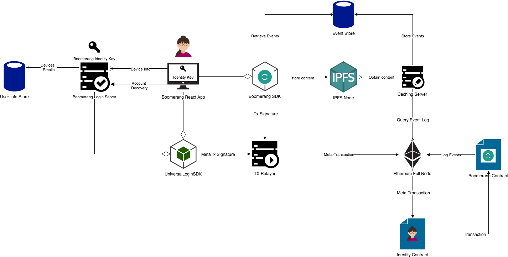

# Boomerang Architecture Overview
Boomerang will implement a [Universal Login](https://github.com/BoomerangProject/boomerang-wiki/blob/master/architecture/UniversalLogin.md) which will make use of a [Metatransaction Relayer](https://github.com/BoomerangProject/boomerang-wiki/blob/master/architecture/MetaTransactionLayer.md) in order to create a seamless user expierence that mirrors the typical flow of a Web 2.0 Application.

In addition, Boomerang will develop the [BoomerangSDK]() for our [Boomerang React App]() and for Businesses to use in order to request reviews, and retreive historical reviews, ratings, and experience levels.

To support the BoomerangSDK, our project will build a [Event Caching Layer]() that will serve data more rapidly to the BoomerangSDK than querying an Ethereum full node.

Boomerang will create the [Boomerang Login Service]() 

