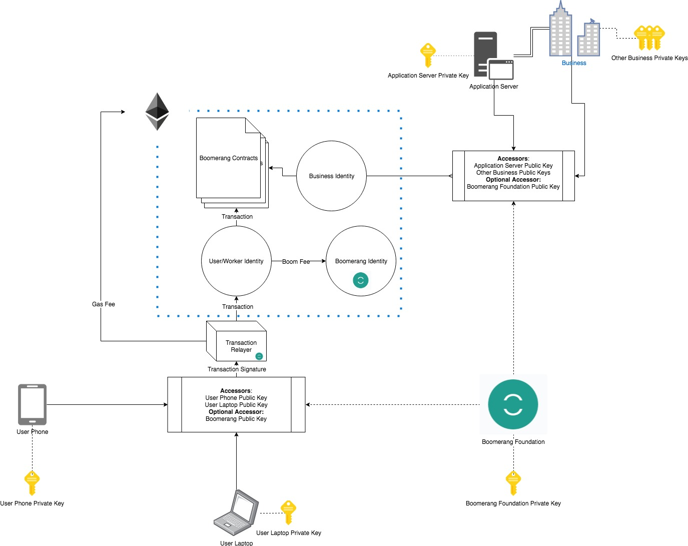

# Boomerang Universal Login
The Boomerang project plans to implement [EIP 1078: Universal Login by Alex Van de Sande.](https://eips.ethereum.org/EIPS/eip-1078)
This EIP describes a method of creating an "Identity" for the user (a contract on the Ethereum Blockchain) in which 
each user device is capable of being an "accessor" to this contract and the user can add new devices or "accessors" in
order to access their account with different devices. This is done by storing a private key on the user's device that 
has permissions on the identity contract. Each device will contain its own private key. The identity contract of the 
user will have an ENS (Ethereum Name Service) subdomain associated with the contract. For example, Bob may create an 
identity with Boomerang and the subdomain bob.boomerang.eth would be associated with his identity.

#### Terms
* **Actor** - User, Worker, or Business
* **ICS** - Identity Creation Service
* **BAR** - Boomerang Account Recovery
* **SBL** - Simplified Boomerang Login

### Creating an Identity through Boomerang
The Boomerang Foundation, aiming to provide a familiar user experience to Web 2.0 Applications, will supply an Identity Creation Service (ICS) for Users, Workers, and Businesses who wish to interact with the Boomerang ecosystem. Through this service, an actor (User, Worker, or Business) will need to complete a verification process (TBD - could be email + phone or captcha) to prevent a [spam attack](https://github.com/BoomerangProject/boomerang-wiki/blob/master/architecture/UniversalLogin.md#spam-attacks-on-boomerangs-identity-creation-service) on our ICS. Part of this verification process will have the actor create login credentials. With these login credentials, an actor can request that the Simplified Boomerang Login (SBL) add a verified device (which has its own private/public key) to the identity contract. If an actor loses access to all of the devices which can access their identity, then they can use their login credentials in order to register a new device with SBL. To an actor this will be very familiar to a Web 2.0 application. However, it is important that the actor is able to opt-out of this service in order to take full advantage of a Web 3.0 DApp (Decentralized Application) in which the actor does not need to trust any centralized 3rd party in order to interact with the DApp.

#### Opting Out of Boomerang Account Recovery and Simplified Boomerang Login
If an actor has used Boomerang's ICS  to create and Ethereum Identity, then they have the option of "Opting Out" of Boomerang Account Recovery (BAR) and Simplified Boomerang Login (SBL). This "Opt-Out" option will probably live inside of the actor's preferences, and come with warnings - similar to the danger zone in GitHub.

.

When the actor "Opts-Out" of BAR and SBL, the Boomerang client will generate a new private key and attach the associated public key to the actor's identity. Then the client will remove the Boomerang Foundation public key from the actor's identity contract, then display either the new private key or mnemonic phrase to the actor to store. From now on if the actor loses access to his devices which are registered to the identity contract, the only way to log into Boomerang will be with this private key or mnemonic phrase. If an actor wishes to register a new device onto his identity through the Boomerang client from here on out, they will need to make a request to their identity contract and accept the request on another device that has previously been registered to the contract.
The architecture diagram will now look like this:

An actor who "Opts-out" will have full control of their identity and will have a completely trustless identity account, of course, the actor is now responsible for ensuring the security and availability of their own identity.

#### Spam Attacks on Boomerang's Identity Creation Service
Since The Boomerang Foundation will be paying the gas costs of creating identity contracts of actors, it is vulnerable to spam attacks which would drain the funds of the Boomerang foundation, while giving the attacker a free Ethereum Identity with an associated ENS subdomain. With this in mind, it is important that Boomerang's ICS has a strong validation mechanism when onboarding new actors. This validation mechanism is still to be determined.

### Login and Account Recovery for Opted-Out Identities, Outside Identites, and Regular Ethereum Accounts
#### Login
##### Opted-Out Identity & Outside Identity
Actor will login to a client on a new device by requesting access to identity contract. Actor will use logged-in device to accept request. Actor can now interact with the Boomerang DApp. In case of Outside Identity actor will not be able to use our clients to accept a request.

##### Regular Ethereum Account
Actor will enter private key into client to be able to interact with the Boomerang DApp.

#### Account Recovery
##### Opted-Out Identity
If an Opted-Out identity loses access to their registered devices, they can use the private key given to them during opt-out to register a new device onto the identity.

##### Outside Identity and Regular Ethereum Account
If an outside identity loses access to their registered devices they will have no way to recover their account,same for a regular ethereum account loseing their private key.

## Whiteboard References
.
